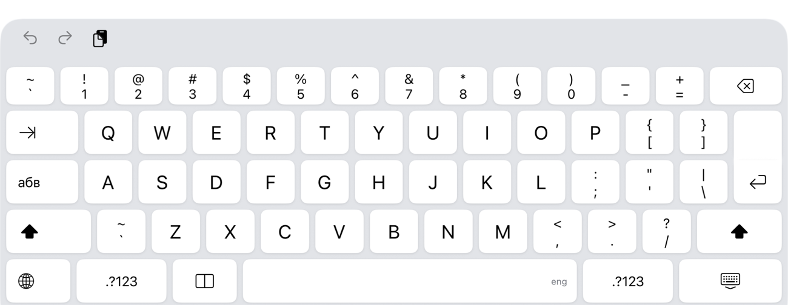
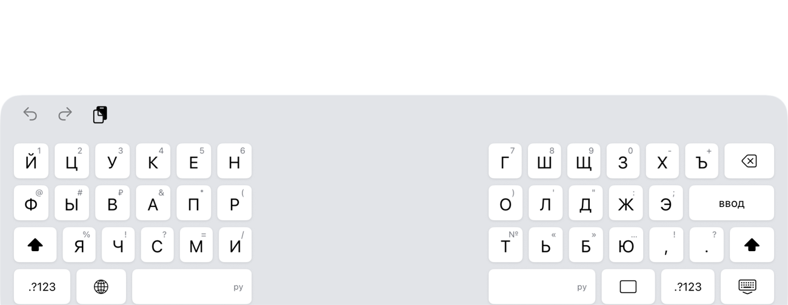

# SplitBoard

Экранная клавиатура для iPad, которая умеет делиться на две половины - то, что Apple
убрала из iPadOS 26.

Swift + UIKit, без сторонних зависимостей.

**App Store:** https://apps.apple.com/app/splitboard/id6795850998




## Что умеет

- **Разделение на две половины** кнопкой ▯▯ в нижнем ряду. Половины прижаты к краям
  экрана - удобно печатать, не выпуская планшет из двух рук.
  Состояние запоминается между запусками.
- **Две раскладки: English и Русский.** Переключаются клавишей `абв`/`abc` слева
  от «а» (как в системной) или коротким нажатием на 🌐; долгое нажатие на 🌐 уходит
  на следующую системную клавиатуру. Активный язык подписан справа на пробеле
  (`eng` / `ру`).
- **Сведённый режим на больших iPad** повторяет системную «расширенную» раскладку:
  цифровой ряд с парными символами, tab, клавиша смены алфавита, ISO-return, нижний ряд.
- **Разделённый режим** повторяет старую split-раскладку Apple: ряды режутся там же,
  где их резала система (правило взято из `UIKBSplitRowHints.plist` в iOS SDK),
  пробел есть в обеих половинах.
- **Удержание клавиши** показывает всплывающее меню с дополнительными символами
  (é ë è, ё, кавычки, валюты, тире) - палец сдвигается к нужному и отпускается.
- Мелочи как у системной: авто-заглавная в начале предложения, двойной пробел = «. »,
  double-tap по shift = caps lock (индикация как в системной - глифом), удержание backspace удаляет посимвольно, потом
  словами, свайп вниз по клавише вводит второй символ (цифру/знак), клик клавиш,
  светлая и тёмная темы, портрет и альбом.

## Раскладка файлов

```
SplitBoard/              приложение-контейнер (инструкция + поле для проверки)
SplitBoardKeyboard/      расширение клавиатуры
  KeyboardViewController.swift  логика ввода, shift/caps, backspace, split
  KeyboardView.swift            выбор раскладки, панели, split-геометрия
  KeyPanel.swift                раскладка рядов внутри панели
  KeyView.swift                 одна клавиша: отрисовка, касания, свайп
  Layouts.swift                 все раскладки (данные)
  Theme.swift                   цвета и метрики под iPadOS 26
project.yml              описание проекта для XcodeGen
```

`SplitBoard.xcodeproj` генерируется: `xcodegen generate` (ставится через `brew install xcodegen`).

## Сборка и установка на iPad

```bash
./install-device.sh
```

Скрипт соберёт проект и поставит его на подключённый iPad. Либо руками:
открыть `SplitBoard.xcodeproj` в Xcode, выбрать устройство, Run.

Для установки кабелем на iPad должен быть включён режим разработчика:
Настройки → Конфиденциальность и безопасность → Режим разработчика → включить,
перезагрузиться и подтвердить. Пункт появляется после первой попытки установки
с мака. Для сборки из TestFlight режим разработчика не нужен.

Дальше на iPad:

1. **Настройки → Основные → Клавиатура → Клавиатуры → Новые клавиатуры → SplitBoard**
2. В любом поле ввода зажать 🌐 и выбрать **SplitBoard**
3. Кнопка ▯▯ в нижнем ряду делит клавиатуру и сводит обратно

Full Access не нужен - клавиатура ничего никуда не отправляет.

## Релиз

Версия 1.0 (сборка 3) прошла ревью с первой подачи 8 августа 2026 года.
Порядок действий для следующей версии и грабли первой подачи - в
[AppStore/CHECKLIST.md](AppStore/CHECKLIST.md). Коротко:

1. Поднять `CURRENT_PROJECT_VERSION` (и `MARKETING_VERSION`, если версия новая).
2. `./archive.sh` - кладёт архив прямо в папку Organizer.
3. `greenlight preflight .` перед отправкой.
4. Organizer → Distribute App → App Store Connect → Upload, затем Submit for Review.

## Известные ограничения

- Между половинами в разделённом режиме остаётся системная подложка клавиатуры:
  сторонним клавиатурам недоступен слой, который её рисует, полностью прозрачной
  середину сделать нельзя.
- Нет предиктивной строки, эмодзи-клавиатуры и диктовки (микрофон системный, в
  стороннюю клавиатуру не выносится).
